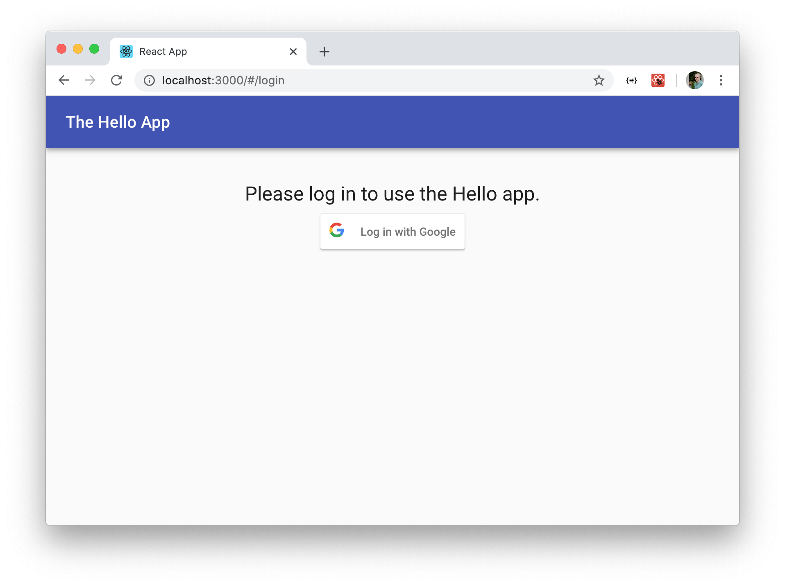

# The Hello app: a demonstration of Sign-In with Google

This repository is a companion to the blog post at
https://hackingathome.wordpress.com/ and demonstrates how to integrate
Sign-In with Google into a web app that uses React (and Material UI) on the
frontend and Python's Flask framework on the backend.



## What's in this repository

**frontend**: This is a React web-app that is the frontend for the Hello
app.  It has a couple of pages: the login screen (pictured about) and a
simple Hello page that shows the user's name and subscriber ID.  The app
shows the user's thumbnail in the upper-right, and when clicked this logs
the user out.  Errors in login/logout are shown using a popup at the bottom
of the window.

**helloapi**: This is the API backend for the Hello app.  It's a Python
flask application, that uses the `flask-login` extension for session
management.  The `google_token` module contains simple logic for calling the
Google SDK to validate ID tokens.

## Contributions

This repository is MIT-licensed; please see the [LICENSE](LICENSE) file.
Pull requests to improve the code are welcome: I'd love to see this as a
canonical example of implementing Sign-In with the Google SDK (and perhaps
in future to add alternative approaches too).  Welcome contributions include
any security fixes and changes to update to newer ways of doing things as
Python and React/JavaScript/Material UI evolve or to make the existing code
more idiomatic.

This example is about using the Google Sign-In SDK, so I don't want to take
changes that use other methods instead (though in future I might add a
separate subdirectory with other approaches).

If you submit contributions you are agreeing to these being incorporated
into the repository and included in the scope of the MIT license covering
the project.

# Trying it out yourself

To try the app out, first you need to create Google OAuth credentials as
discussed in the linked blog article.  You can do this in the [Google
developer console](https://console.developers.google.com/).

Then, check out this repository.  Open two windows: one in the `frontend`
directory and the other in the `helloapi` directory.

## Setting up the backend

In the `helloapi` directory, create a `config.py` file by copying the
example one and putting in your Google Client ID from the step above.
Create an app secret by running `python -c 'import os; os.urandom(20)"` and
paste the result into config file (including the quotes, `b'...'`).

The code was written to work with Python 3.6 onwards.  The best practise is
to specify a particular Python version so I chose version 3.8, which is
available on Ubuntu 20.04 as the default.  On other systems, using `pipenv`
should still give you a working result and, if you have
[pyenv](https://github.com/pyenv/pyenv#basic-github-checkout) installed,
offer the option of installing Python 3.8 if you don't already have it.
**Be sure to follow the installation instructions for `pyenv` fully,
including installing appropriate dependencies on your system before using
`pipenv` as this isn't handled automatically.**

In the `helloapi` directory run `pipenv shell`, then `HELLO_CONFIG=config.py flask run`, assuming your config file is called `config.py`:

```
andy@proton:~/google-login/helloapi$ python3 -m pipenv install
Warning: Python 3.8 was not found on your system…
Would you like us to install CPython 3.8.2 with pyenv? [Y/n]: y
Installing CPython 3.8.2 with pyenv (this may take a few minutes)…
✔ Success!
Downloading Python-3.8.2.tar.xz...
-> https://www.python.org/ftp/python/3.8.2/Python-3.8.2.tar.xz
Installing Python-3.8.2...
WARNING: The Python bz2 extension was not compiled. Missing the bzip2 lib?
WARNING: The Python sqlite3 extension was not compiled. Missing the SQLite3 lib?
Installed Python-3.8.2 to /home/andy/.pyenv/versions/3.8.2


Creating a virtualenv for this project…
Pipfile: /home/andy/google-login/helloapi/Pipfile
Using /home/andy/.pyenv/versions/3.8.2/bin/python (3.8.2) to create virtualenv…
⠸ Creating virtual environment...created virtual environment CPython3.8.2.final.0-64 in 176ms
  creator CPython3Posix(dest=/home/andy/.local/share/virtualenvs/helloapi-Yyp7TfCq, clear=False, global=False)
  seeder FromAppData(download=False, pip=latest, setuptools=latest, wheel=latest, via=copy, app_data_dir=/home/andy/.local/share/virtualenv/seed-app-data/v1.0.1)
  activators BashActivator,CShellActivator,FishActivator,PowerShellActivator,PythonActivator,XonshActivator

✔ Successfully created virtual environment! 
Virtualenv location: /home/andy/.local/share/virtualenvs/helloapi-Yyp7TfCq
Installing dependencies from Pipfile.lock (7f527e)…
  🐍   ▉▉▉▉▉▉▉▉▉▉▉▉▉▉▉▉▉▉▉▉▉▉▉▉▉▉▉▉▉▉▉▉ 37/37 — 00:00:08
To activate this project's virtualenv, run pipenv shell.
Alternatively, run a command inside the virtualenv with pipenv run.

andy@proton:~/google-login/helloapi$ python3 -m pipenv run python -m py.test
================================================================= test session starts ==================================================================
platform linux -- Python 3.8.2, pytest-5.4.1, py-1.8.1, pluggy-0.13.1
rootdir: /home/andy/google-login/helloapi
plugins: cov-2.8.1
collected 7 items

tests/test_app.py ....                                                                                                                           [ 57%]
tests/test_google_token.py ...                                                                                                                   [100%]

=================================================================== warnings summary ===================================================================
/home/andy/.local/share/virtualenvs/helloapi-Yyp7TfCq/lib/python3.8/site-packages/flask_restplus/fields.py:17
  /home/andy/.local/share/virtualenvs/helloapi-Yyp7TfCq/lib/python3.8/site-packages/flask_restplus/fields.py:17: DeprecationWarning: The import 'werkzeug.cached_property' is deprecated and will be removed in Werkzeug 1.0. Use 'from werkzeug.utils import cached_property' instead.
    from werkzeug import cached_property

/home/andy/.local/share/virtualenvs/helloapi-Yyp7TfCq/lib/python3.8/site-packages/flask_restplus/model.py:8
  /home/andy/.local/share/virtualenvs/helloapi-Yyp7TfCq/lib/python3.8/site-packages/flask_restplus/model.py:8: DeprecationWarning: Using or importing the ABCs from 'collections' instead of from 'collections.abc' is deprecated since Python 3.3, and in 3.9 it will stop working
    from collections import OrderedDict, MutableMapping

-- Docs: https://docs.pytest.org/en/latest/warnings.html
============================================================ 7 passed, 2 warnings in 0.27s =============================================================

```

Now you can run the backend app:
```
andy@proton:~/google-login/helloapi$ python3 -m pipenv shell
Launching subshell in virtual environment…
andy@proton:~/google-login/helloapi$  . /home/andy/.local/share/virtualenvs/helloapi-Yyp7TfCq/bin/activate
(helloapi) andy@proton:~/google-login/helloapi$ HELLO_CONFIG=config.py flask run
 * Environment: production
   WARNING: This is a development server. Do not use it in a production deployment.
   Use a production WSGI server instead.
 * Debug mode: off
 * Running on http://127.0.0.1:5000/ (Press CTRL+C to quit)
```


## Setting up the frontend

In another window, change to the `frontend` directory.  Run `npm start` and
you should be good!


```
andy@proton:~/google-login/frontend$ npm start

Compiled successfully!

You can now view frontend in the browser.

  Local:            http://localhost:3000/
  On Your Network:  http://<ip address>:3000/

Note that the development build is not optimized.
To create a production build, use npm run build.
```

Considerably easier than the Python version!

## Now try it out

Go to the frontend address in your browser and you should see the app.